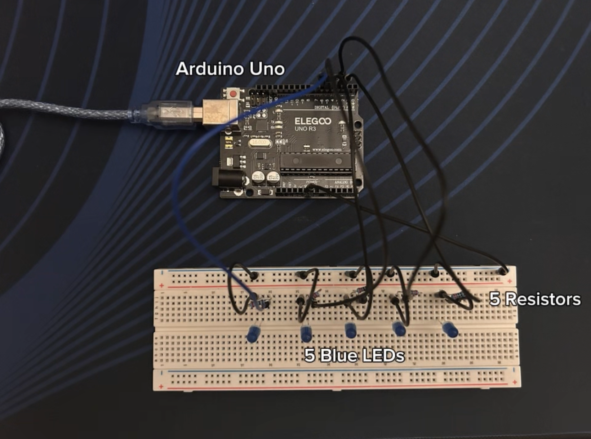

## Finger Tracker (LED)
A real-time hand-tracking system that counts raised fingers using a webcam and lights up matching LEDs on an Arduino, using computer vision instead of physical sensors.

## Photos

## Demo
[Full demo video](Media/Finger-Tracker-Demo.mov)

## Features:
1. Real-time hand detection using MediaPipe's HandLandmarker model, tracking 21 landmark points per hand
2. Custom finger-counting logic: compares each fingertip's vertical position to its lower knuckle to detect if it's raised
3. Distance-based thumb detection (measures thumb tip distance from the pinky's base knuckle) instead of direction-based, to work correctly on both hands
4. Mirrored camera feed for a natural, selfie-style view
5. Live on-screen overlay showing detected hand landmarks and current finger count
6. Serial communication to Arduino, only sending updates when the finger count actually changes
7. 5 LEDs light up on the Arduino, matching the number of raised fingers in real time

## Tech Stack:
- Microcontroller: Arduino UNO
- Vision: Python 3.12, OpenCV, MediaPipe (Tasks API, HandLandmarker, CPU delegate)
- Communication: pyserial (USB serial, 9600 baud)
- Output: 5 LEDs with 220Ω resistors
- Language: Python (vision + logic), C++ (Arduino)

## How to Run:
1. Clone the repo and create a Python virtual environment (Python 3.12 recommended — newer versions may not support MediaPipe yet)
2. Install dependencies: `pip install opencv-python mediapipe==0.10.14 pyserial`
3. Ensure `hand_landmarker.task` is in the project folder (MediaPipe's hand model file)
4. Wire 5 LEDs to Arduino pins 2, 3, 4, 5, 6, each with a 220Ω resistor, sharing one GND rail
5. Open the Arduino sketch (`.ino` file) in Arduino IDE, select Arduino UNO as the board and the correct port, and upload
6. Update the serial port name in `hand_test.py` to match your Arduino's port
7. Run `python3 hand_test.py`

## Controls:
- Hold up 0–5 fingers on one hand in front of the camera
- The on-screen count and the LEDs update live to match

## Why I Made This:
I built this as my first computer vision project, having no prior CV experience going in. It was a hands-on way to learn how a full vision pipeline actually works. From raw camera frames to a pre-trained detection model to my own geometric logic, and then bridge that into physical hardware over serial. Along the way I debugged real, undocumented issues specific to my setup: a Python version incompatible with MediaPipe, a GPU-related crash on macOS, and a camera index conflict caused by iPhone Continuity Camera.
